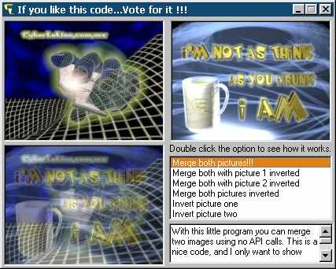



## A picture/image Merger without API calls\. Ver 2\.

### Description

This code is the second part of the Picture/image mixer. But here you can invert a picture with pixel manipulation, you can merge two pictures, and this is just using the .PSET and .POINT function ofa picture box. This does not use any OCX or API calls. This is great or beginners.
 
### More Info
 
Just select the option, and see how it works...

A third image.

             |
---                |---
**Submitted On**   |2000-08-08 19:00:34
**By**             |[Mauricio Castelazo Gamboa](https://github.com/Planet-Source-Code/PSCIndex/blob/master/ByAuthor/mauricio-castelazo-gamboa.md)
**Level**          |Beginner
**User Rating**    |4.9 (146 globes from 30 users)
**Compatibility**  |VB 5\.0, VB 6\.0
**Category**       |[Graphics](https://github.com/Planet-Source-Code/PSCIndex/blob/master/ByCategory/graphics__1-46.md)
**World**          |[Visual Basic](https://github.com/Planet-Source-Code/PSCIndex/blob/master/ByWorld/visual-basic.md)
**Archive File**   |[CODE\_UPLOAD88798112000\.zip](https://github.com/Planet-Source-Code/mauricio-castelazo-gamboa-a-picture-image-merger-without-api-calls-ver-2__1-10616/archive/master.zip)

